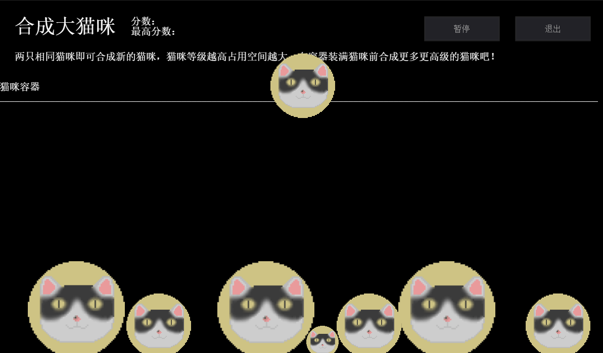

# 合成大猫咪 0.1.1
这是一个用 GameCreator 制作的类似合成大西瓜的游戏

目前的截屏：

### 使用核心模板和以下可视化编辑器：

1. 行走图编辑器
2. 界面编辑器
3. 自定义指令编辑器（配合代码）
4. 场景编辑器
5. 对话框样式编辑器

### TODO-List
<input type="checkbox" checked disabled> 碰撞检测

<input type="checkbox" disabled> 优化碰撞检测

<input type="checkbox" disabled> 防止溢出边界

<input type="checkbox" disabled> 将某些要计算的量用常量代替

<input type="checkbox" disabled> 计算分数

<input type="checkbox" disabled> 保存最高分

<input type="checkbox" disabled> 暂停游戏

<input type="checkbox" disabled> 退出和重新进入游戏

<input type="checkbox" disabled> 排行榜

<input type="checkbox" disabled> 优化界面